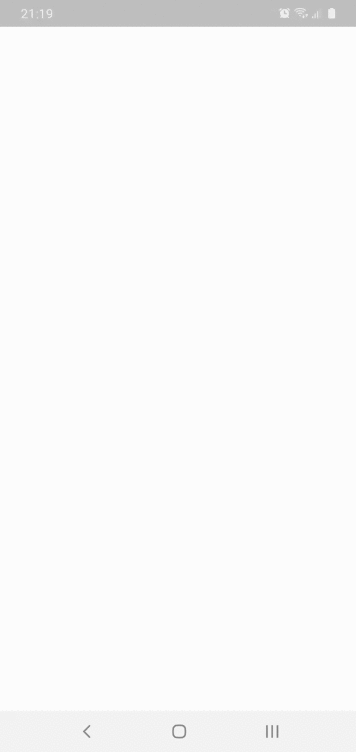
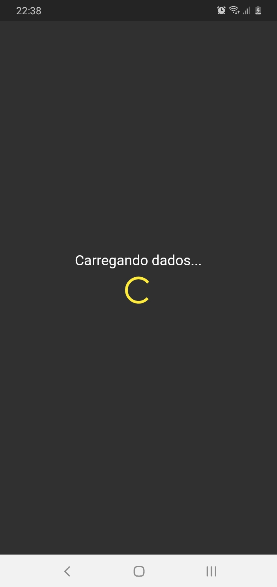
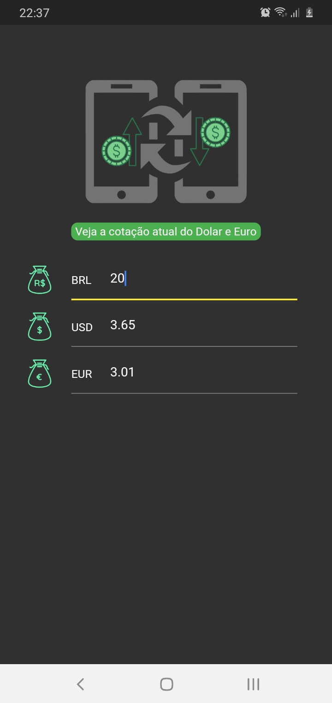
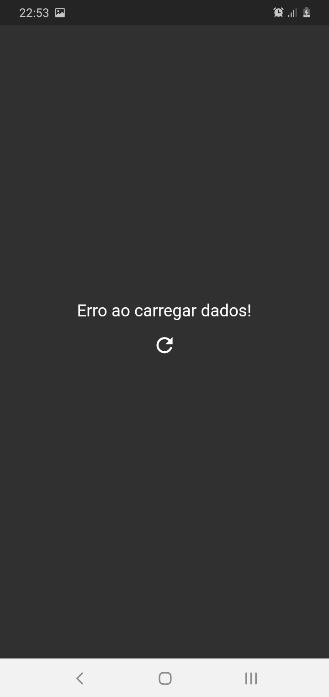

<h1 align="center">
 
  
 
   Conversor de Moedas 
</h1>

 Aplicativo para fazer conversão de moedas...   ...real, dolar e euro!

  

  

[//]: # (Adicione seus gifs / imagens aqui:)

 
   

   
  
  
  

## **Informações:**
[//]: # (Descreva seu objetivo e o que foi usado no projeto:)

* Projeto criado com objetivo de desenvolver habilidades no desenvolvimento de aplicativos com Flutter.
* Minha principal dificuldade no desenvolvimento do projeto, foi fazer a recuperação dos dados para serem exibidos na tela.
* OBS: Este projeto, não foi otimizado para IOs, porém pode rodar normalmente.

- **[HG-Finance: Api](https://console.hgbrasil.com/documentation/finance)** - Foi usado uma API na requisição de valores do Dólar e Euro, para serem consumidas no APP. 

<!-- ## **How to reach me:**
[//]: # (Adicione suas redes:)

[Instagram - Pessoal](https://www.instagram.com/dannbrandao_)

 -->

## **Linguagens e Ferramentas:**
[//]: # (Adicione os recursos do seu projeto aqui:)

- <code></code> **Flutter**
- <code></code> **Dart**

## Iniciar Projeto
[//]: # (Descreva aqui a forma de usar / instalar seu projeto:)

## License

Este projeto está licenciado sob a Licença MIT - consulte a [LICENSE](https://choosealicense.com/licenses/mit/) página para detalhes.
